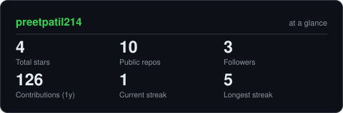
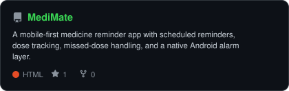
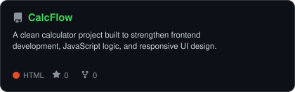
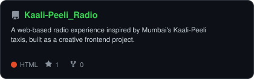
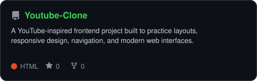
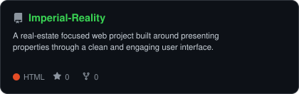
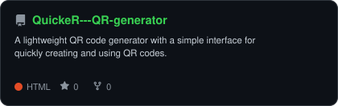

<!-- PORTRAIT - generated by scripts/dotify.py from assets/jacket.png.
     Colour mode, so one file serves both GitHub themes. Regenerate with:
       python scripts/dotify.py assets/jacket.png -o assets/portrait \
         --cols 100 --equalize --detail 0.5 --color -->

 

<!-- NAME / TAGLINE - animated typing -->

 
<!-- SOCIALS & VIEWS -->

  
  &nbsp;&nbsp;
  
  &nbsp;&nbsp;
  

---

## Who am i ?

Hi, I'm **Preet Patil**. I enjoy building software, solving problems, and continuously learning how things work under the hood.

- Currently focused on improving my **Data Structures & Algorithms** skills

- Learning **JavaScript + Web Development + Python + Machine Learning**

- Portfolio: **Coming soon**

- Always learning, experimenting, and building something better

- Fun fact: **I started coding because I wanted to build things I wished existed.**
 

## `1.` ToolBox

---

## `2.` Skill Radar

<table>
<tr>
<td width="50%" align="center" valign="middle">

<!-- Self-rated radar - edit assets/skills.json, the workflow redraws it -->
<picture>
  <source media="(prefers-color-scheme: dark)"  srcset="assets/radar-dark.svg">
  <source media="(prefers-color-scheme: light)" srcset="assets/radar-light.svg">
  
</picture>

</td>
<td width="50%" align="center" valign="middle">

<!-- Live radar built from real language byte counts across your repos -->
<picture>
  <source media="(prefers-color-scheme: dark)"  srcset="assets/radar-langs-dark.svg">
  <source media="(prefers-color-scheme: light)" srcset="assets/radar-langs-light.svg">
  
</picture>

</td>
</tr>
</table>

---

## `3.` Contribution calendar

<!-- 3D isometric calendar, regenerated every 6h by .github/workflows/metrics.yml -->

  

<!-- Snake eats the contribution graph - .github/workflows/snake.yml -->
<picture>
  <source media="(prefers-color-scheme: dark)" srcset="https://raw.githubusercontent.com/preetpatil214/preetpatil214/output/snake-dark.svg">
  <source media="(prefers-color-scheme: light)" srcset="https://raw.githubusercontent.com/preetpatil214/preetpatil214/output/snake.svg">
  
</picture>

---

## `4.` The Numbers

<!-- Generated by scripts/cards.py into this repo. Deliberately NOT
     github-readme-stats / streak-stats / github-profile-trophy: those are
     shared public instances that go down and take the whole section with them. -->
<picture>
  <source media="(prefers-color-scheme: dark)"  srcset="assets/card-stats-dark.svg">
  <source media="(prefers-color-scheme: light)" srcset="assets/card-stats-light.svg">
  
</picture>

 

  

---

## `.5` Selected Work

<!-- Cards generated by scripts/cards.py from assets/projects.json.
     Stars, forks and language are pulled live from the API on every run. -->

<table>
<tr>
<td width="50%">

  <a href="https://github.com/preetpatil214/MediMate">
    <picture>
      <source media="(prefers-color-scheme: dark)" srcset="assets/card-MediMate-dark.svg">
      <source media="(prefers-color-scheme: light)" srcset="assets/card-MediMate-light.svg">
      
    </picture>
  </a>

</td>
<td width="50%">

  <a href="https://github.com/preetpatil214/BookMyService">
    <picture>
      <source media="(prefers-color-scheme: dark)" srcset="assets/card-BookMyService-dark.svg">
      <source media="(prefers-color-scheme: light)" srcset="assets/card-BookMyService-light.svg">
      
    </picture>
  </a>

</td>
</tr>

<tr>
<td width="50%">

  <a href="https://github.com/preetpatil214/CalcFlow">
    <picture>
      <source media="(prefers-color-scheme: dark)" srcset="assets/card-CalcFlow-dark.svg">
      <source media="(prefers-color-scheme: light)" srcset="assets/card-CalcFlow-light.svg">
      
    </picture>
  </a>

</td>
<td width="50%">

  <a href="https://github.com/preetpatil214/Kaali-Peeli_Radio">
    <picture>
      <source media="(prefers-color-scheme: dark)" srcset="assets/card-Kaali-Peeli_Radio-dark.svg">
      <source media="(prefers-color-scheme: light)" srcset="assets/card-Kaali-Peeli_Radio-light.svg">
      
    </picture>
  </a>

</td>
</tr>

<tr>
<td width="50%">

  <a href="https://github.com/preetpatil214/Youtube-Clone">
    <picture>
      <source media="(prefers-color-scheme: dark)" srcset="assets/card-Youtube-Clone-dark.svg">
      <source media="(prefers-color-scheme: light)" srcset="assets/card-Youtube-Clone-light.svg">
      
    </picture>
  </a>

</td>
<td width="50%">

  <a href="https://github.com/preetpatil214/Imperial-Reality">
    <picture>
      <source media="(prefers-color-scheme: dark)" srcset="assets/card-Imperial-Reality-dark.svg">
      <source media="(prefers-color-scheme: light)" srcset="assets/card-Imperial-Reality-light.svg">
      
    </picture>
  </a>

</td>
</tr>

<tr>
<td width="50%">

  <a href="https://github.com/preetpatil214/QuickeR---QR-generator">
    <picture>
      <source media="(prefers-color-scheme: dark)" srcset="assets/card-QuickeR---QR-generator-dark.svg">
      <source media="(prefers-color-scheme: light)" srcset="assets/card-QuickeR---QR-generator-light.svg">
      
    </picture>
  </a>

</td>
<td width="50%">

  <a href="https://github.com/preetpatil214/WAQT----an-ambient-timer">
    <picture>
      <source media="(prefers-color-scheme: dark)" srcset="assets/card-WAQT----an-ambient-timer-dark.svg">
      <source media="(prefers-color-scheme: light)" srcset="assets/card-WAQT----an-ambient-timer-light.svg">
      
    </picture>
  </a>

</td>
</tr>
</table>

| project | live | stack |
|---|---|---|
| **[MediMate](https://github.com/preetpatil214/MediMate)** | — | `HTML` `CSS` `JavaScript` `Android` |
| **[BookMyService](https://github.com/preetpatil214/BookMyService)** | — | `HTML` `CSS` `JavaScript` |
| **[CalcFlow](https://github.com/preetpatil214/CalcFlow)** | — | `HTML` `CSS` `JavaScript` |
| **[Kaali-Peeli Radio](https://github.com/preetpatil214/Kaali-Peeli_Radio)** | — | `HTML` `CSS` `JavaScript` |
| **[Youtube Clone](https://github.com/preetpatil214/Youtube-Clone)** | — | `HTML` `CSS` `JavaScript` |
| **[Imperial Reality](https://github.com/preetpatil214/Imperial-Reality)** | — | `HTML` `CSS` `JavaScript` |
| **[QuickeR — QR Generator](https://github.com/preetpatil214/QuickeR---QR-generator)** | — | `HTML` `CSS` `JavaScript` |
| **[WAQT — an ambient timer](https://github.com/preetpatil214/WAQT----an-ambient-timer)** | — | `HTML` `CSS` `JavaScript` |

---

"Built from curiosity. Driven by ambition. Powered by consistency."

